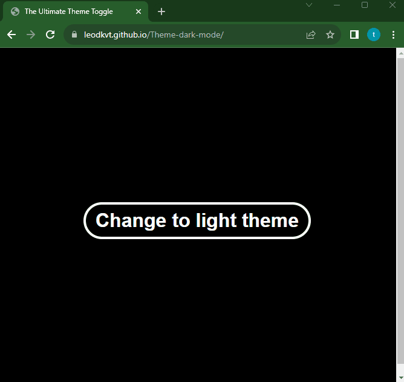

# The Ultimate Theme Toggle
Este é um projeto onde permite aos usuários alternar entre tema claro e escuro.

Visite o site → [The Ultimate Theme Toggle](https://leodkvt.github.io/Theme-dark-mode/)

## Demo


## Tech Stack
 - [HTML](https://developer.mozilla.org/en-US/docs/Web/HTML) - Markup Language
 - [CSS](https://developer.mozilla.org/en-US/docs/Web/CSS) - Style Sheet Language
 - [JavaScript](https://developer.mozilla.org/pt-BR/docs/Web/JavaScript) - Programming Language
 - [Github Pages](https://pages.github.com/) - Hosting

## Cloning the Repository.
Se você tiver o [Git](https://git-scm.com/) instalado em seu computador, basta clonar ou baixar o repositório executando o seguinte comando em seu terminal.

```bash
git clone https://github.com/LeoDKVT/Theme-dark-mode
```
Como alternativa, clique neste [link](https://github.com/LeoDKVT/Theme-dark-mode/archive/refs/heads/main.zip) para baixá-lo.

### Contribuições são bem-vindas❤️.
